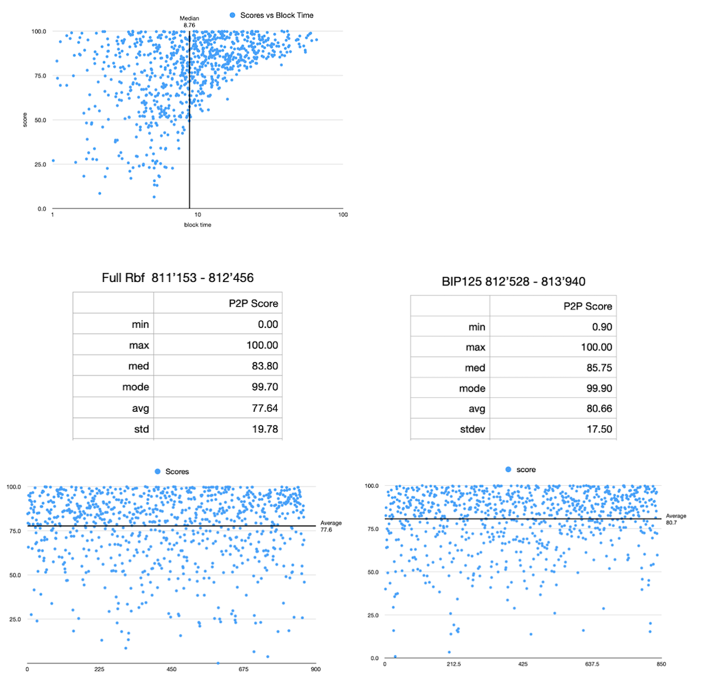

# Blog

## Evaluating the predictiveness of block composition under variable relay policy

Here are some early results of a study in progress that seeks to compare the accuracy of anticipated transaction data in newly confirmed blocks under different policy conditions. The available data thus far represents a trial run of the experimental methods. Plans are underway to expand the scope of analysis in the coming months.

### Question:
Will a bitcoin node configured with *mempoolfullrbf* see more of its pool of unconfirmed transactions be included in the next block than a node running the default configuration?

<!-- data -->
<!--  -->

At first glance, I don't see much difference in the two samples, though I'd say it's far from conclusive for reasons I'll mention shortly, but overall I'm pleased to have implemented the chosen methodology. 

<!-- methods primer -->
In each of the two test cases, we captured the node's view of the mempool using bitcoind's *getblocktemplate* RPC, and this was repeated at 5 minute intervals. The result of *getblocktemplate* is, as the name suggests, a template for a consensus-valid block containing a set of transactions the node considers candidates for block inclusion. An interval of 5 minutes was chosen because it's less than the average block time of 10 minutes, so it's relatively certain we would create a new template at least once per block.

When a new block arrives, we compare the transaction data in the newly confirmed block to those present in the most recent block template. We then quantify the degree of similarity using a metric dubbed the *P2P Index Score* following a simple formula:
    
> *score* = (*actual* - *unseen*) / *actual*

where *unseen* is the number of transactions occurring in the *actual* block and not in the projected block. Hence, *score* is a number between 0 and 1, with 1 representing perfect similitude, expressed as a percent as shown in the accompanying figures. The set of scores were filtered to exclude obviously invalid ones. For example, if the duration between two consecutive blocks is less than the configured block template interval, the last block template will have been rendered stale upon scoring the first block, and hence the computed score for the second block should be discarded. That's the gist as far as methodology.

<!-- informal discussion -->
Without commenting much on the data, I would direct your attention briefly to the top figure plotting *score* vs *block time*. We see the data is noisy below a time of ten minutes, but we see a positive correlation emerge as block times grow longer than the average. While unrelated to mempool policy, this serves to build an intuition that a longer block time affords unconfirmed transactions ample time to propagate and thus a greater chance they'll be represented in the projected block. Similarly for the scatterplots of *block score*, the relative density of data above the 50% line is reassurance that the node has a somewhat accurate view of the space of unconfirmed transactions, and that there may yet be insights to glean.

There were some flaws (or at least nuances) in the execution that deserve to be mentioned:

1) **The two datasets weren't run side-by-side** as is evidenced by the block ranges. A more robust study should control this.

2) **The meaning of *unseen* in the formula for *score* is nuanced.** A transaction found in an actual block that wasn't previously projected may still be present in the local mempool, hence it was technically *seen* by our node - it just didn't make it into the next block. More context is needed to determine the cause of the discrepancy.

3) **No attempt was made to control the number or type of peer connections made.** I will say in the fullrbf scenario, an attempt was made to ensure we had at least one fullrbf peer, but in fairness, perhaps that should have been done for both scenarios. In general I'm not sure we *should* try to tightly control the quality of connections, as they can be handled automatically while requiring no input from the user. At the very least we should ensure the connection count doesn't drop so low as to risk being cut off from normal relay activity, and if the bip125-enforcing node allows a certain connection type (tor, i2p, etc), then the same configuration should be mirrored on the fullrbf node. An approach at the other extreme would have us make *only* manual connections to the same group of peers in each scenario. This option may be considered for future trials.

4) As noted in the methods primer, we discarded scores for a block that arrived below the refresh interval of 5 minutes, however **implementing the criteria that would uniformly filter invalid data is nuanced.** For instance, imagine the duration between two blocks is 2 minutes: since this is less than the defined template interval, we assume the result should be dropped. But what if a new template is crunched at minute 1, i.e. one minute after the arrival of the first block and one minute prior to the arrival of the next? In this case we should keep both scores. Sometimes blocks arrive only seconds apart. How small a range should be allowed before considering it "too soon" to compute a score for the second block? I'm open to ideas for improvement here. From the small amount of data available, we can already see the range of block scores spans all possible values making it difficult to spot outliers and leaving little indication that an invalid point might stand out from the rest.

To make matters worse, it turns out there is no optimal duration for the template refresh interval that minimizes invalid results. Early on, I naively envisioned block times spread over a normal bell curve, and that taking the time at say 2 standard deviations below the mean would capture the bulk of the data we're interested in. In fact the distribution of block time is anything but normal, because the standard deviation of block time **is the average block time**, i.e. 10 minutes. In statistics this pattern is characteristic of what's called an exponential distribution. In bitcoin, it comes as a consequence of pure probabilistic block times and, being the unrefined statistician, is something I was enlightened to learn.

Lastly, the next iteration of the study should include much more data, which entails letting the collection phase run (ideally uninterrupted) for an extended time. The raw data set from the trial run included around 1000 blocks in each scenario. A more robust dataset should include perhaps 10 times that much. Further, consider that 1000 blocks is only about half of one difficulty period. If the experiment were run over the course of say 6 months (even intermittently, as long as both nodes are collecting at the same times), then we'd have more opportunities to gather a variety of data across different mempool regimes.

<!-- link to csv -->
Raw data  
[fullrbf.csv](doc/mempool-util/examples/fullrbf.csv)  
[bip125.csv](doc/mempool-util/examples/bip125.csv)
