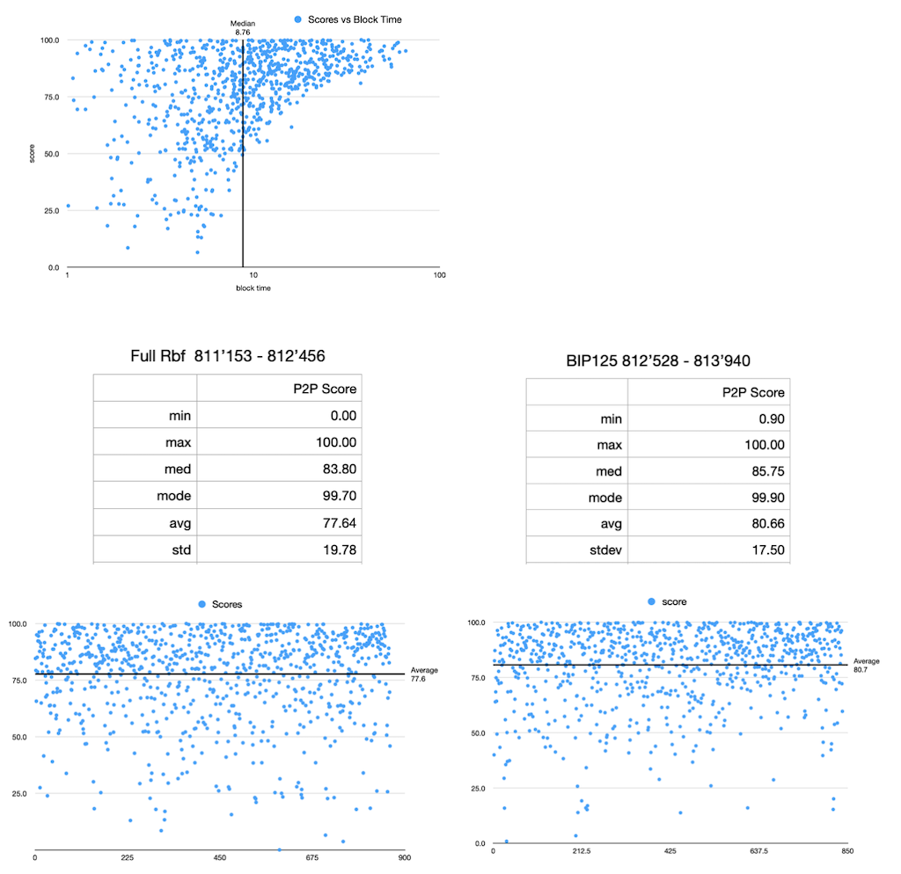

# Blog

## Goodbye, Cruel World

A post-mortem on the retirement of `bitcoincore-rpc`, a beloved and long-standing fixture of the Rust Bitcoin ecosystem.

On November 25, 2025, the `bitcoincore-rpc` repository was officiallly archived, marking the end of development of a widely used Rust client for Bitcoin Core’s JSON-RPC interface. This post analyzes the technical, organizational, and ecosystem-level factors that led to its retirement. Rather than attribute the outcome to a single point of failure, the analysis shows how compounding design decisions, maintenance policies, and resource constraints rendered the project increasingly difficult to sustain. The post concludes with some lessons learned and observations about potential successor projects.

As an early mover, the `bitcoincore-rpc` library gradually became a cornerstone of the industry, reportedly being used in production systems, by providing a high-level, strongly typed interface to Bitcoin Core’s JSON-RPC API. At the time of being archived, the project’s metrics showed continued relevance:

* Latest release: v0.19.0
* 573 commits across 248 pull requests
* 385 GitHub stars
* More than 1,400 dependent repos
* Nearly 2 million downloads on crates.io

The repository showed limited activity after May 2024, aside from a final README update in late 2025. To those following [discussions](https://github.com/rust-bitcoin/rust-bitcoin/issues/184) over the years, the library's end of life perhaps didn't come as a surprise, but was nonetheless disruptive given its widespread adoption.

### No single failure event

The retirement of `bitcoincore-rpc` can't be attributed to a catastrophic event, security incident, or internal conflict; bug fixes and incremental features continued to land relatively late in the project’s life. The library remained functional and useful at the time it was archived. Instead of collapsing under acute stress, `bitcoincore-rpc` accumulated structural liabilities that increased maintenance costs over time until continuation was no longer viable.

### Technical constraints

1. Synchronous design

The library exposed a synchronous API and did not adopt async abstractions. While this was a reasonable design choice originally, the Rust ecosystem has more or less standardized on using asynchronous frameworks for practically anything involving network layer communication. Retrofitting async support into an established API would have required substantial effort and long-term parallel support, adding significant complexity.

2. Opinionated HTTP client

`bitcoincore-rpc` was tightly coupled to a specific HTTP and JSON-RPC implementation (`rust-jsonrpc`). As a result, transport-layer concerns such as Tor support, TLS behavior, and connection management surfaced as feature requests against the client library itself.
This coupling conflicted with the stated scope of the rust-bitcoin organization, which famously avoids maintaining general-purpose networking code. The library came to inherit responsibilities that its maintainers were not structurally positioned to handle.

3. Compatibility woes

Bitcoin Core’s RPC interface evolves continuously. `bitcoincore-rpc` handles compatibility by hard-coding runtime checks and conditional logic based on the version of Bitcoin Core running on the host system. As a policy for maintaining version compatibility, this strategy is fundamentally unscalable. Each new Bitcoin Core release increases the possible internal states and surface area for bugs. Without a formal compatibility policy or deprecation strategy, maintenance became an increasing headache over time.

RPC methods and types were manually maintained. There was no automated process for generating or validating the RPC schema against specific Bitcoin Core versions. Consequently, correctness and quality assurance relied on continuous manual intervention.

The monolithic design and no modular separation increased the cost of refactors and discouraged partial rewrites. Proposed changes that addressed long-standing design issues tended to be large and invasive, raising the bar for review and acceptance.

4. Social factors

The rising technical debt isn't a problem that's unique to the `bitcoincore-rpc` project; instead the human element also played a decisive role.
Over time, review bandwidth diminished while the number and scope of open pull requests increased. Some proposals attempted to address fundamental design issues, but lacked a clear path to acceptance. Worse, leadership went quiet with no apparent delegation or path of succession.

The combination of structural and organizational headwinds is what most likely led to burnout as the community witnessed a tragedy of the commons play out in real time, ironically at a time of [peak popularity](https://www.star-history.com/#rust-bitcoin/rust-bitcoincore-rpc&type=date&legend=top-left).

In the short term, the absence of `bitcoincore-rpc` is likely to cause increased fragmentation. Projects may implement narrowly scoped RPC clients tailored to specific use cases and environments, and that's not inherently bad. Let 1000 flowers bloom.

#### A hero emerges

The `corepc` repository has arrived just in time to fill the vacuum in the wake of `bitcoincore-rpc`. Residing in the rust-bitcoin GitHub organization, `corepc` has taken over management of the Rust data structures for modeling the JSON-RPC interface. Meanwhile, `jsonrpc`, by operating at the network level, lives on as the backbone of the experimental client.

There is debate about the suitability of the client for production use. The internal complexity and extensive use of declarative macros, presents a high barrier to entry for contributors. Nevertheless, the project, by providing version-specific JSON compatible types, acts as a Schelling point for developers and a shared foundation throughout the ecosystem.

Still other potential alternatives have been discussed like automatic [code generation](https://github.com/rust-bitcoin/corepc/issues/4) and schema validation directly from Bitcoin Core, and even the prospect of changing the RPC framework altogether with Cap'n Proto. So far these remain areas of exploration.

#### Lessons learned

In closing, the departure of `bitcoincore-rpc` reflects sustained systemic pressures rather than isolated mistakes. The project succeeded in widespread adoption but accumulated technical costs that exceeded the willingness to adapt and change.

There are a number of take-aways we can glean from this case study:

1. Software doesn't maintain itself. Left alone, software will eventually fail, regardless of its initial quality. Projects that have historically demonstrated long-term stability are invariably backed by a strong team who dedicate their time to ensuring long term success, not just for clicks and the downloads, but out of necessity because their actions carry real world consequences. Case in point: the [`curl` project](https://www.youtube.com/watch?v=6n2eDcRjSsk).

2. Design for the long term. This requires both the discipline to say no to feature-creep as well as a willingness to pursue the occasional rewrite if it significantly impacts the long term viability of a project.

<!-- References -->
<!-- Star history chart: <https://www.star-history.com/#rust-bitcoin/rust-bitcoincore-rpc&type=date&legend=top-left> -->
<!-- AI slop attacks on the `curl` project: <https://www.youtube.com/watch?v=6n2eDcRjSsk> -->
<!-- rust-bitcoin discussion thread: <https://github.com/rust-bitcoin/rust-bitcoin/discussions/2777> -->
<!-- Take rust-bitcoin-rpc under the org umbrella?: <https://github.com/rust-bitcoin/rust-bitcoin/issues/184> -->
<!-- Consider using code generation to produce Rust from structured JSON <https://github.com/rust-bitcoin/corepc/issues/4> -->

#### What's new in BDK in Q4 2025

Finally I wanted to give a quick update on progress in Bitcoin Dev Kit

- I'm eagerly anticipating the upcoming release of `bdk_tx` v0.2.0
- #297 "Create PSBT" initial development phase is complete, the PR just needs review eyeballs and a little time to bake.
- `bdk_sqlite` is receiving more attention, with plans to improve testing and continue adding features to keep up with the needs of wallet users
- `bdk_bitcoind_client` is just getting off the ground. We have plans to make it the new client to be used within the `bdk_bitcoind_rpc` library

## Good Things Come in Three
<!-- Q3 bdk progress update -->

Autumn is a time of reflection, and as I reflect on Q3 there is a lot to be thankful for. Toward the end of the second quarter of 2025 there were some goals I had outlined related to the development of Bitcoin Dev Kit. These included

  1. UTXO locking feature
  2. A modular transaction building library
  3. Enhancements to `LocalChain`

I won't take credit for all of them, but I can say as a team we've made progress on all fronts.

### Accomplishments

#### **Persistent UTXO Locking ([#259](https://github.com/bitcoindevkit/bdk_wallet/pull/259))**  
This feature is in review and the work addresses a need for stateful coin control. There are several benefits that come with the ability to "ban" a UTXO from being selected. Maybe you're saving up for a lambo and don't want to extinguish your most treasured output when you go to make an inoccuous purchase. Or maybe you need to prevent dust and toxic change from cramping your on-chain activity.

#### **Release of [`bdk-tx`](https://crates.io/crates/bdk_tx)**  
Since the initial 0.1.0 version of `bdk_tx` was officially released into the wild at the end of May 2025, I remain focused on not only shipping improvements but becoming a bona fide user of the API as someone concerned with building valid transactions.

#### **Toward A General LocalChain ([#1582](https://github.com/bitcoindevkit/bdk/pull/1582))**  
I acted as a reviewer on a PR that made `LocalChain` generic over the inner block data, enabling the ability to constuct chains of more sophisticated and novel types. The obvious case of storing 80 bytes of information-rich block header in a checkpoint has been described as the "killer feature". There is still work to be done if we hope to eventually expose this at the language bindings layer.

Another notable improvement was the **FilterIter Redesign ([#2000](https://github.com/bitcoindevkit/bdk/pull/2000))**. This was an effort that took careful and patient review from many contributors. The benefit is without a doubt a more reliable `FilterIter`, complete with reorg detection.

 

### Coming soon

In the coming months I want to continue pushing to new frontiers while refining the core libraries and laying a foundation for the wider ecosystem. The 3.0 version of BDK Wallet is near, and as they say, good things come in three.

#### **Multi-Keychain Wallet**  
I'm working with others on unlocking support for many keychains (i.e. descriptors) and moving past the current 2-keychain design. It will be exciting to see the kinds of use cases developers come up with.

#### **Create PSBT ([#297](https://github.com/bitcoindevkit/bdk_wallet/pull/297))**  
I am currently heads down on bringing a new tx builder interface to `bdk_wallet`. The integration includes a major overhaul of the internal logic when it comes to spending conditions and input selection. It will be a learning process to make everything work in a way that is both powerful and familiar.

#### **Blockchain clients:**  
I've started development on a [rust crate](https://crates.io/crates/mempool_space_api) designed to model responses from the mempool.space [REST API](https://mempool.space/docs/api/rest). This is important because the Electrum ecosystem is fraught by increasing protocol fragmentation, causing subtle differences between major implementations and leaving many unsure where to turn. The new library has a central purpose to guarantee compatibility with mempool.space and takes inspiration from electrum and esplora APIs. The work also critically enables us to make long term design choices while benefiting from new language features.

Lastly I want to mention [`block-graph`](https://github.com/ValuedMammal/block-graph). I plan to continue stress-testing the implementation and would like to see it evolve into a future proposal. A bonus is that it is expected to bring performance improvements and efficiently handles graphs of a million blocks.

#### **Continuing education:**  

I attended TABConf in October, followed by a 3-day meetup at Bitcoin Park in Nashville.

All in all I am excited about the progress made in Q3 and look forward to delivering similar results in Q4. Don't hesitate to reach out if you want to collaborate.

## Which came first?

Transaction order is important for a variety of reasons. Obviously it matters for consensus - nodes need to be able to validate transactions sequentially in a block. But it's also important for UX, that is users expect to view of list of their transactions in a meaningful order - "I received _this_ before I sent _that_". However the exact methodology for obtaining a reliable sorting is not always clear.

<!-- problem statement -->
The transaction graph models the relationships and dependencies between transactions, but has **no natural order** on its own. This is in part due to the Rust data structures involved. For instance `HashMap`, which is unordered by design, produces values in arbitrary order. As a result, queries on the graph can be unpredictable in the order of returned elements if not explicitly sorted.
Additionally, the graph lacks certain metadata you might commonly find in user-facing apps like the time that a transaction was created, limiting our ability to impose a chronological order.
Even if this information were available, a transaction's place in the global order depends on other factors, like whether it gets replaced or dropped from the mempool, and the height or time that it finally confirms on chain, if it ever confirms.

<!-- currrent state of things -->
Canonical transactions can be ordered by **chain position**, based on confirmation height or last-seen, which is a good approximation. But what if a package of related transactions confirms in the same block? Depending on the members of a batch to be canonicalized, we could inadvertently split apart groups of related transactions that might logically go together.

<!-- perhaps the fix is to look for any unspent descendants of the tx being canonicalized -->
<!-- it may not be the case that a descendant appears at a later point in time -->
<!-- the refined approach is left as an exercise for the reader  -->

<!-- package selector -->
One proposed solution, `PackageSelector`, seeks to uphold the simple requirement that ancestors precede descendants in a given topology. It conceptually relies on the same methods of tx graph traversal that we know and love.

<!-- ancestor score -->
You can probably think of other ways we might find to order a list of transactions that a user would find relevant. Arguably one of the most common ways is to sort transactions by feerate as an indicator of how lucrative to the network it is to mine a transaction But to be effective, the implementation must also be **package-aware**. To illustrate, a high-feerate child tx may look attractive to the miner but it can't simply be included in a block without knowledge of the parent, so if they are both eligible for inclusion at the same time, the miner would be wise to consider the feerate of the package when taken as a whole, since every transaction included takes up more precious block space.
The traditional **ancestor score** method, while useful, has its shortcomings that can impact incentive-compatibility[^1], like wrongfully evicting an objectively fee-rich transaction at a time when the mempool is full.
If on the other hand there was a way to produce a total order of transactions using techniques like **cluster-mempool**, it could potentially produce better mining results under the same general constraints.

Before I go, I wanted to share some of the things I'm looking forward to in Q2

- The arrival of **bdk_wallet 2.0.0** which brings enhancements to the transaction graph of the kind I just mentioned.
- **Saving in-progress transactions** and enabling UTXO-locking.
- Continued development on **`bdk_tx`**, a modular transaction building library.
- Unlocking a long-awaited feature which is to **store headers in the local chain**.

<!-- footnotes -->
[^1]: [An overview of the cluster mempool proposal](https://delvingbitcoin.org/t/an-overview-of-the-cluster-mempool-proposal/393)  

---

## 2024 year in review

2024 was a year of accomplishments and challenges working as a contributor to open-source software. For this grant period my goal was to build a mechanism of wallet syncing using compact block filters. Not long after starting, development pivoted away from the initial candidate to use as a library dependency toward a [fresh alternative](https://github.com/rustaceanrob/kyoto). The shift has allowed us to consolidate efforts, and so far the results are promising.

Already I've witnessed or taken part in a lot of changes to the core library since becoming a contributor around the time of alpha.4. New to me was writing CI workflows and becoming a maintainer. Some of the notable achievements from this year include building a minimal [CBF client](https://github.com/bitcoindevkit/bdk/pull/1614) around the Core RPC interface and replacing BDK's `policy` code with the modern and sophisticated miniscript [`plan` module](https://github.com/bitcoindevkit/bdk/pull/1786) (granted this work is still evolving). I managed to identify a [flaw in `LocalChain`](https://github.com/bitcoindevkit/bdk/issues/1634) and contributed to a timely fix. This was also the year that BDK released version 1.0 of the wallet library. During this time I also made an effort to support new contributors and together I think we're creating a great culture and dev experience.

On the periphery, I helped curate some of the latest documentation for [Book of BDK](https://bookofbdk.com), developed `bdk_kyoto` with rustaceanrob, and bootstrapped a new project `bdk_sqlx`. I continue to provide support and maintenance for our electrum and esplora client libraries.

In terms of continuing education I was fortunate to attend two conferences this year: bitcoin++ in Buenos Aires as well as the prestigious and enlightening rust-bitcoin summit in Nashville. Additionally, I published results of a months-long mini-study on mempool policy, prototyped a new "block graph" concept, and even found time to work on a pet project [Loon](https://github.com/ValuedMammal/loon), which ties together several high level concepts and is made possible because of all the hard work and dedication that has gone into developing the underlying libraries. Finally, I was pleased to see progress made on one of the first rust projects that I worked on - the rust DeepL API clients, [async](https://github.com/Avimitin/deepl-rs) and [blocking](https://github.com/ValuedMammal/deeprl).

I expect 2025 to be even more exciting. Some of the things I hope to follow or push forward are to continue BDK's support for compact block filters, the transaction builder re-write, and developing solutions for a new rust Bitcoin Core RPC client for integration testing. I want to thank BDK Foundation for supporting me through this journey. Happy new year and stay hungry. 🐾

## Casual research running `-mempoolfullrbf`

### Prelude

I published results from the first iteration of this mini-study in Nov 2023 which I encourage anyone to read as a short primer. In this post I'll share the remaining findings as I wind down the second phase of the study and offer some closing thoughts and ideas for the future.

To refresh, we're asking whether running `-mempoolfullrbf` as a default policy is a better predictor of next-block contents than not. I use a metric _P2P Score_ as an indicator of the degree of similarity between a node's current block template and the next confirmed block.

One difference between this round and the previous is that we reduced the block template interval from 5min to 3min. Additionally I've added a column for block fees to the raw data set, as I thought it might be interesting to study trends between fees and block time, fees and score, etc (but those results aren't in yet).

### Results

These are scatterplots of ~2000 data points in each test between heights 827650 and 856176.

<!-- plot -->

### Discussion

The sample means were so strikingly similar that I didn't bother applying any statistics to them. I did however conduct a 1-way analysis of variance (ANOVA) to test a suspicion that the fullrbf node experienced less variance in score.

<!-- anova -->

An obvious confounding variable was **node uptime** which could affect network visability. The fullrbf node is an always-on server while the bip125 node is a pruned node on an old laptop that is off most of the time. I attempted to smooth out that variation by making sure the nodes were peered with one another giving them the opportunity to share their own mempool contents.

One of the reasons I took on this exploration was to engage in a larger discussion about the health of the p2p network. It's important that node operators have a habit of monitoring statistics to track changes in usage by network participants.

The score is intentionally "dumb". We would like it to have a value close to 1, but deviations from perfect aren't necessarily a cause for concern. Indeed we expect to see variation by virtue of the distributed network - some nodes see some transactions and other nodes see others. It would be unrealistic to expect perfection from every block - certainly that would make it less useful as a metric. Thankfully I was surprised to observe such high p2p scores on a regular basis. In contrast, witnessing large or prolonged deviations could be a sign that either **1)** local policy has fallen adrift of the wider network or **2)** significant volumes of transactions are confirming having never entered the mempool to begin with.

In terms of policy I don't take a stance on whether nodes should conform to miner practices or vice versa. I do think we should try to strike a balance between sane and reliable defaults while recognizing the need to evolve and adapt policy with the aim of making the mempool an efficient place where users will want to transact.

### Resources

- [policy: enable full-rbf by default #30493](https://github.com/bitcoin/bitcoin/pull/30493)
- [ValuedMammal/mempool-util](https://github.com/ValuedMammal/mempool-util)

## Evaluating the predictiveness of block composition under variable relay policy

Here are some early results of a study in progress that seeks to compare the accuracy of anticipated transaction data in newly confirmed blocks under different policy conditions. The available data thus far represents a trial run of the experimental methods. Plans are underway to expand the scope of analysis in the coming months.

### Question:
Will a bitcoin node configured with *mempoolfullrbf* see more of its pool of unconfirmed transactions be included in the next block than a node running the default configuration?

<!-- data -->
<!--  -->

At first glance, I don't see much difference in the two samples, though I'd say it's far from conclusive for reasons I'll mention shortly, but overall I'm pleased to have implemented the chosen methodology. 

<!-- methods primer -->
In each of the two test cases, we captured the node's view of the mempool using bitcoind's *getblocktemplate* RPC, and this was repeated at 5 minute intervals. The result of *getblocktemplate* is, as the name suggests, a template for a consensus-valid block containing a set of transactions the node considers candidates for block inclusion. An interval of 5 minutes was chosen because it's less than the average block time of 10 minutes, so it's relatively certain we would create a new template at least once per block.

When a new block arrives, we compare the transaction data in the newly confirmed block to those present in the most recent block template. We then quantify the degree of similarity using a metric dubbed the *P2P Index Score* following a simple formula:
    
> *score* = (*actual* - *unseen*) / *actual*

where *unseen* is the number of transactions occurring in the *actual* block and not in the projected block. Hence, *score* is a number between 0 and 1, with 1 representing perfect similitude, expressed as a percent as shown in the accompanying figures. The set of scores were filtered to exclude obviously invalid ones. For example, if the duration between two consecutive blocks is less than the configured block template interval, the last block template will have been rendered stale upon scoring the first block, and hence the computed score for the second block should be discarded. That's the gist as far as methodology.

<!-- informal discussion -->
Without commenting much on the data, I would direct your attention briefly to the top figure plotting *score* vs *block time*. We see the data is noisy below a time of ten minutes, but we see a positive correlation emerge as block times grow longer than the average. While unrelated to mempool policy, this serves to build an intuition that a longer block time affords unconfirmed transactions ample time to propagate and thus a greater chance they'll be represented in the projected block. Similarly for the scatterplots of *block score*, the relative density of data above the 50% line is reassurance that the node has a somewhat accurate view of the space of unconfirmed transactions, and that there may yet be insights to glean.

There were some flaws (or at least nuances) in the execution that deserve to be mentioned:

1) **The two datasets weren't run side-by-side** as is evidenced by the block ranges. A more robust study should control this.

2) **The meaning of *unseen* in the formula for *score* is nuanced.** A transaction found in an actual block that wasn't previously projected may still be present in the local mempool, hence it was technically *seen* by our node - it just didn't make it into the next block. More context is needed to determine the cause of the discrepancy.

3) **No attempt was made to control the number or type of peer connections made.** I will say in the fullrbf scenario, an attempt was made to ensure we had at least one fullrbf peer, but in fairness, perhaps that should have been done for both scenarios. In general I'm not sure we *should* try to tightly control the quality of connections, as they can be handled automatically while requiring no input from the user. At the very least we should ensure the connection count doesn't drop so low as to risk being cut off from normal relay activity, and if the bip125-enforcing node allows a certain connection type (tor, i2p, etc), then the same configuration should be mirrored on the fullrbf node. An approach at the other extreme would have us make *only* manual connections to the same group of peers in each scenario. This option may be considered for future trials.

4) As noted in the methods primer, we discarded scores for a block that arrived below the refresh interval of 5 minutes, however **implementing the criteria that would uniformly filter invalid data is nuanced.** For instance, imagine the duration between two blocks is 2 minutes: since this is less than the defined template interval, we assume the result should be dropped. But what if a new template is crunched at minute 1, i.e. one minute after the arrival of the first block and one minute prior to the arrival of the next? In this case we should keep both scores. Sometimes blocks arrive only seconds apart. How small a range should be allowed before considering it "too soon" to compute a score for the second block? I'm open to ideas for improvement here. From the small amount of data available, we can already see the range of block scores spans all possible values making it difficult to spot outliers and leaving little indication that an invalid point might stand out from the rest.

To make matters worse, it turns out there is no optimal duration for the template refresh interval that minimizes invalid results. Early on, I naively envisioned block times spread over a normal bell curve, and that taking the time at say 2 standard deviations below the mean would capture the bulk of the data we're interested in. In fact the distribution of block time is anything but normal, because the standard deviation of block time **is the average block time**, i.e. 10 minutes. In statistics this pattern is characteristic of what's called an exponential distribution. In bitcoin, it comes as a consequence of pure probabilistic block times and, being the unrefined statistician, is something I was enlightened to learn.

Lastly, the next iteration of the study should include much more data, which entails letting the collection phase run (ideally uninterrupted) for an extended time. The raw data set from the trial run included around 1000 blocks in each scenario. A more robust dataset should include perhaps 10 times that much. Further, consider that 1000 blocks is only about half of one difficulty period. If the experiment were run over the course of say 6 months (even intermittently, as long as both nodes are collecting at the same times), then we'd have more opportunities to gather a variety of data across different mempool regimes.

<!-- link to csv -->
Raw data  
[fullrbf.csv](doc/mempool-util/examples/fullrbf.csv)  
[bip125.csv](doc/mempool-util/examples/bip125.csv)

 

## How to verify a signed message using Sparrow

1) Download [Sparrow](https://www.sparrowwallet.com/) for desktop. Open the app.
2) Go to **Tools** -> **Sign/Verify Message**
3) Fill in the address, message, and signature. Click 'verify'. The result is that the signature is either valid or it's not.

**Example**  
-----BEGIN BITCOIN SIGNED MESSAGE-----  
Send sats here!  
-----BEGIN BITCOIN SIGNATURE-----  
bc1qg35sdfjkpk9dwcxmx9t8qmnju9cl8g42cnry50  
J1MaTfrU2S7btQVXEVpikNpxe/XNK/DFzWN5USIXaSGdDryLHN9fOiJD4VGFTlpPSrkMU1n0Ln4kzKyix8bXQP4=  
-----END BITCOIN SIGNATURE-----  

**Why is this important?**  
A valid signature shows that the entity who signed the message controls the keys associated with the address, and it gives the sender some confidence they're not sending sats into a black hole. Likewise, you should be extremely skeptical of an entity who claims to control an address but is unable to produce a signature. Not your keys, not your coins.

**How does it work?**  
Bitcoin relies on public key crypto which is asymmetric, meaning keys come in pairs of private/public keys. The public key is derived from the private key. To serve as an effective signing scheme, signatures need to be difficult or impossible to forge, yet trivial to verify. To produce a signature, the signer finds a random point on the elliptic curve and computes a proof that is a function of the nonce, the message hash, the EC point, and the priv key. If the verifier can recover the same EC point using the signature and the pubkey, then the signature is deemed valid.

updated: 4Feb 2024
